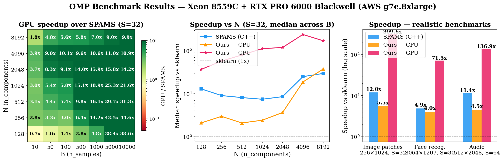

# Batched OMP: Fast Orthogonal Matching Pursuit for CPU and GPU

**Paper:** [Efficient Batched CPU/GPU Implementation of Orthogonal Matching Pursuit for Python](https://arxiv.org/abs/2407.06434)

Batched implementation of Orthogonal Matching Pursuit (OMP) using BLAS (CPU) and PyTorch (GPU). Solves thousands of sparse coding problems simultaneously, achieving **up to 37x speedup over scikit-learn** on GPU and **3-5x on CPU**. Drop-in sklearn replacement with native GPU support.




### Speedup vs scikit-learn

| Config | Dimensions | Sparsity | Samples | Best CPU | v0 GPU | SPAMS (C++) |
|--------|-----------|----------|---------|----------|--------|-------------|
| Image patches | 256 x 1024 | 32 | 5000 | 4.4x | 37x | **43x** |
| Face recognition | 8064 x 1207 | 30 | 1207 | 3.2x† | **9.1x** | 2.9x |
| Audio | 512 x 2048 | 64 | 5000 | 5.5x | OOM | 54x |

† v0_blas variant, best CPU method for large n_features. Standard v0 CPU gets 4.4x / 1.2x / 5.5x respectively.

*Hardware: Intel Core Ultra 9 185H, NVIDIA RTX 4060 Laptop (8 GB)*

### When to use batched-omp

- **Have a GPU?** Use `v0` on CUDA — fastest pure-Python OMP available (beats SPAMS on face recognition by 3x)
- **CPU only, want a sklearn drop-in?** Use `v0` or `v0_blas` — 3-5x faster, same API, no C dependencies
- **CPU only, maximum speed?** [SPAMS](https://thoth.inrialpes.fr/people/mairal/spams/) is faster (C++ with OpenMP) but harder to install
- **Few signals or small problems?** sklearn is fine — batching helps most with hundreds+ of signals

## Installation

Requires Python 3.10+ and a C compiler (for Cython BLAS extensions).

```bash
pip install -e ".[dev]"
```

For GPU support, install [PyTorch with CUDA](https://pytorch.org/get-started/locally/) first.

## Quick Start

```python
from batched_omp import run_omp
import torch

# Dictionary X: (n_features, n_components), signals y: (n_samples, n_features)
X = torch.randn(256, 1024, dtype=torch.float64)
X /= X.norm(dim=0)  # normalize columns
y = torch.randn(5000, 256, dtype=torch.float64)

# Solve: find 32-sparse representations of y in dictionary X
coefs = run_omp(X, y, n_nonzero_coefs=32, normalize=False, fit_intercept=False)
# coefs: (5000, 1024) — sparse coefficient matrix
```

**GPU** — just move tensors to CUDA:

```python
coefs_gpu = run_omp(X.cuda(), y.cuda(), n_nonzero_coefs=32,
                    normalize=False, fit_intercept=False)
```

**NumPy arrays** work too — they're converted to tensors internally:

```python
coefs = run_omp(X_numpy, y_numpy, n_nonzero_coefs=32)
```

### API

```python
run_omp(X, y, n_nonzero_coefs, precompute=True, tol=0.0,
        normalize=True, fit_intercept=True, alg='v0')
```

| Parameter | Description |
|-----------|-------------|
| `X` | Dictionary matrix `(n_features, n_components)`. Tensor or ndarray. |
| `y` | Signal matrix `(n_samples, n_features)`. Tensor or ndarray. |
| `n_nonzero_coefs` | Maximum number of non-zero coefficients per sample. |
| `tol` | Residual norm threshold for early stopping. `0` disables. |
| `normalize` | Column-normalize `X` before solving (undo on output). |
| `fit_intercept` | Center `X` and `y` before solving. |
| `alg` | `'v0'` (default, fastest), `'naive'`, or `'v0_blas'` (CPU-only, Cython BLAS). |

Returns a `(n_samples, n_components)` tensor of sparse coefficients.

## Algorithms

All algorithms are **batched** — they solve B sparse coding problems in parallel using matrix operations instead of looping over samples.

| Algorithm | Description | Best for |
|-----------|-------------|----------|
| **v0** | Inverse Cholesky factorization. Updates the Cholesky inverse iteratively, avoiding a linear solve each iteration. Uses `torch.baddbmm`, `torch.bmm`, `torch.gather`. | GPU (any size), CPU (small-medium n_features) |
| **naive** | Batched Cholesky. Builds and solves the normal equations each iteration. CPU path uses packed triangular storage + BLAS (`dppsv`, `idamax`). | GPU when memory is tight |
| **v0_blas** | NumPy + Cython BLAS variant of v0. Calls `dgemv`/`daxpy`/`idamax` directly via scipy's BLAS interface. | CPU with large n_features (e.g. 8064) |

## Project Structure

```
src/batched_omp/           — the library (torch + numpy + scipy, no sklearn)
    omp.py                 — run_omp, omp_naive, omp_v0, omp_v0_blas
    utils.py               — batch_mm, innerp, cholesky_solve, elapsed_timer
    blas_kernels/           — Cython BLAS wrappers (daxpy, dgemv, dppsv, idamax)
benchmarks/
    benchmarks.py          — benchmarking harness with sklearn baseline
    plot_results.py        — generates the 3-panel figure above
    results/               — benchmark outputs and plots
```

## Running Benchmarks

```bash
# Realistic configs (image patches, face recognition, audio)
python benchmarks/benchmarks.py all

# Parameter sweep: N x B x S heatmaps (takes ~20 min)
python benchmarks/benchmarks.py sweep
python benchmarks/plot_sweep.py

# Ablation study: isolates contribution of batching, Gram precomputation, inverse Cholesky
python benchmarks/benchmarks.py ablation
python benchmarks/plot_ablation.py

# CPU only
python benchmarks/benchmarks.py image_patches --no-gpu
```

Ablation results show that **batching is the dominant optimization** — processing all signals simultaneously provides 4-750x speedup over single-sample loops. Gram precomputation and inverse Cholesky contribute 1-2x each.

## Citation

```bibtex
@article{lubonja2024efficient,
  title={Efficient batched CPU/GPU implementation of orthogonal matching pursuit for Python},
  author={Lubonja, Ariel and Pr{\"a}sius, Sebastian Kazmarek and Tran, Trac Duy},
  journal={arXiv preprint arXiv:2407.06434},
  year={2024}
}
```
